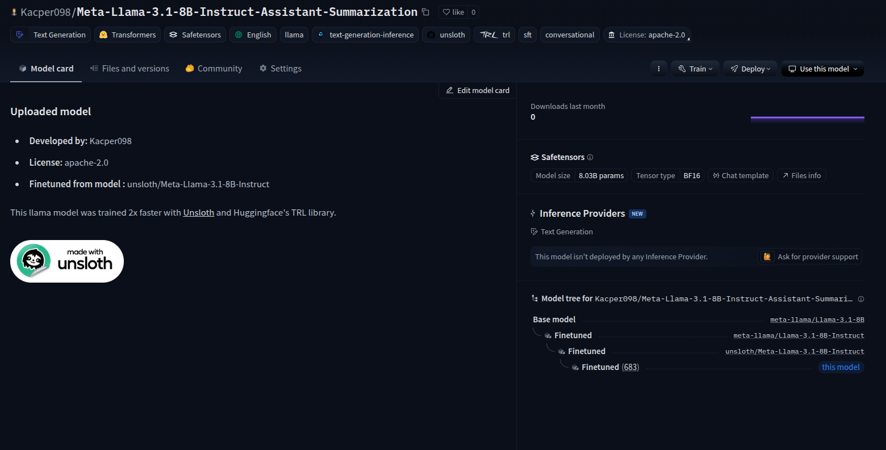

# Offline Module

## Installation

To install the dependencies and activate the virtual environment, run the following commands:

```bash
uv venv .venv-offline
. ./.venv-offline/bin/activate # or source ./.venv-offline/bin/activate
uv pip install -e .
```

We use [Crew4AI](https://github.com/unclecode/crawl4ai) for crawling. To finish setting it up you have to run some post-installation setup commands (more on why this is needed in their [docs](https://github.com/unclecode/crawl4ai)):
```bash
# Run post-installation setup
uv pip install -U "crawl4ai==0.4.247" # We have to upgrade crawl4ai to support these CLI commands (we couldn't add it to pyproject.toml due to ZenML version incompatibility with Pydantic).
crawl4ai-setup

# Verify your installation
crawl4ai-doctor
```

## Environment Configuration

You have to set up your environment:
1. Create your environment file:
   ```bash
   cp .env.example .env
   ```
2. Open `.env` and configure the required credentials

## 🏗️ Set Up Your Local Infrastructure

To start it, run:
```bash
make local-infrastructure-up
```

To stop it, run:
```bash
make local-infrastructure-down
```

> [!NOTE]
> To visualize the raw and RAG data from MongoDB, you can use [MongoDB Compass](https://rebrand.ly/second-brain-course-mongodb-compass).

## ETL pipeline

### Prepare Notion data

Add Markdown exported documents from Notion to data/notion folder. 

**OR** if you want to collect Notion data automaticaly (prepared but not tested yet):
```bash
make collect-notion-data-pipeline
```

### Run the ETL pipeline

Run the ETL pipeline to crawl, score and ingest the Notion data into MongoDB:
```bash
make etl-pipeline
```

# ETL Pipeline for AI Personal Assistant

## Overview

The ETL (Extract, Transform, Load) pipeline is a core component of the AI Personal Assistant, responsible for collecting, processing, and preparing knowledge data for retrieval. Built with MLOps best practices, the pipeline transforms Notion documents and web content into a structured knowledge base that powers the assistant's responses.

## Architecture

The pipeline follows a modular architecture using ZenML for orchestration and implements the FTI (Flexible, Transparent, Iterative) approach:

Notion Documents (Extract) → Web Crawling (Transform) → Quality Scoring (Transform) → Document Storage (Transform) → MongoDB (Load)


### Components

1. **Data Extraction**
   - Reads Markdown documents exported from Notion
   - Identifies URLs within documents for further processing
   - Support for direct Notion API integration (in development)

2. **Web Crawling**
   - Uses Crawl4AI to efficiently process URLs found in Notion documents
   - Converts web content into normalized Markdown format
   - Preserves document relationships (parent-child)
   - Implements parallel processing with configurable concurrency


3. **Quality Assessment**
   - Two-stage document quality evaluation:
     - Heuristic filtering: Rule-based initial screening
     - LLM-based scoring: Uses Ollama with Qwen2.5 for nuanced quality assessment
   - Assigns quality scores to prioritize high-value content

4. **Document Storage**
   - Preserves processed documents in a structured file system
   - Maintains document metadata including quality metrics
   - Supports obfuscation for sensitive information

5. **MongoDB Integration**
   - Loads enhanced documents into MongoDB
   - Prepares data for efficient vector-based retrieval
   - Sets foundation for RAG (Retrieval Augmented Generation)


### Data Flow

1. The pipeline starts by reading Notion documents from the local filesystem
2. It extracts and processes URLs found within these documents
3. Each document undergoes quality evaluation using both rule-based and AI approaches
4. The system enriches documents with metadata, quality scores, and relationships
5. Processed documents are stored both on disk and in MongoDB for retrieval

### Technical Highlights

- **MLOps Integration**: ZenML orchestration for reproducible pipeline runs
- **Metadata Tracking**: Comprehensive logging of document processing metrics
- **Quality Control**: Intelligent filtering to prioritize high-quality content
- **Scalability**: Parallel processing with configurable resource utilization
- **Flexibility**: Modular design allows for easy extension and customization

## Generate Fine-tuning Dataset

1. Extracted Raw Data: Pulled the initial set of raw documents (~400) from MongoDB.
2. Initial Data Exploration: Used histograms to analyze the content length and quality scores of the extracted documents.
3. Threshold Determination: Examined the distributions revealed by the histograms to decide on suitable thresholds for filtering 4. out low-quality or insufficient documents.


4. First Filtering (Documents): Applied the determined thresholds to filter out "noisy" documents (those with low quality scores or not enough descriptive content), resulting in a smaller set of ~250 high-quality documents.
5. Summary Generation: Generated summaries for each of the ~250 high-quality documents using Large Language Models (LLMs) and specific prompt engineering techniques.
6. Data Augmentation: Generated multiple summaries for each document (by varying LLM parameters like temperature) to increase the dataset size and capture variations for model fine-tuning.
7. Second Filtering (Summaries): Applied another layer of filtering specifically to the generated summaries, removing those that did not meet desired length and quality criteria.
8. Data Splitting & Packaging: Split the final set of filtered, high-quality summaries into training, evaluation, and testing sets Packaged these splits into the final dataset structure.
9. Dataset Publication: Pushed the final summarization instruct dataset to the Hugging Face Data Registry.


10. Pipeline Management: Utilized ZenML as the MLOps framework to orchestrate, run, track, and version the entire pipeline, including its configurations and output artifacts.


# Fine-tuning LLM for Document Summarization

To enhance the capabilities of our RAG system, particularly in generating concise and relevant summaries from retrieved documents, we undertook a fine-tuning process for a state-of-the-art Large Language Model (LLM). This specialized model forms a crucial component of our information synthesis pipeline.

### Objective

The primary goal of fine-tuning was to adapt a general-purpose LLM to excel specifically at document summarization tasks. We aimed to create a model that could:
*   Understand the nuances of our specific document types (or the general domain of documents targeted).
*   Generate summaries that are coherent, accurate, and capture the key information from the source text.
*   Produce summaries in a style and length suitable for integration into our RAG system's output.

### Model Selection

*   **Base Model:** Llama 3.1 8B
*   **Rationale:** We selected Llama 3.1 8B due to its strong foundational capabilities, impressive performance on various NLP benchmarks, and its manageable size for fine-tuning within reasonable resource constraints (especially relevant for Google Colab environments). The 8B parameter version offers a good balance between performance and computational cost.

### Fine-tuning Framework and Environment

*   **Framework:** Unsloth
    *   **Rationale:** Unsloth was chosen for its significant speed improvements (up to 2x faster) and memory efficiency (up to 60% less RAM) when fine-tuning LLMs. This allows for training larger models or using larger batch sizes on available hardware, even free-tier Google Colab GPUs. Unsloth achieves this through optimized kernels, re-engineered RoPE scaling, and efficient implementations of techniques like LoRA.
*   **Underlying Libraries:** The process leverages Hugging Face Transformers, PEFT (Parameter-Efficient Fine-Tuning), and bitsandbytes (for quantization, if used).
*   **Environment:** Google Colab
    *   **GPU:** The fine-tuning was performed on a Google Colab instance equipped with a GPU (e.g., NVIDIA T4, V100, or A100, available in free or paid tiers). Unsloth's efficiency makes it particularly well-suited for these environments.
*   **Programming Language:** Python

### Fine-tuning Process

The fine-tuning process followed these key steps:

1.  **Environment Setup:**
    *   Installation of Unsloth, Transformers, PEFT, bitsandbytes, accelerate, and other necessary libraries.
    *   Configuration of the Colab runtime to utilize the available GPU.

2.  **Data Preparation:**
    *   Loading the custom summarization dataset.
    *   Preprocessing the data, including tokenization using the Llama 3.1 8B tokenizer. A specific instruction-following prompt template was used to structure the input for the model. For example:
        ```
        <s>[INST] Summarize the following document:
        {document_text} [/INST] {summary_text} </s>
        ```
    *   Splitting the dataset into training and (optional) validation sets.

3.  **Model Configuration & Loading:**
    *   Loading the Llama 3.1 8B model using Unsloth's `FastLanguageModel`. This step often includes options for `dtype` (e.g., `bfloat16` for faster training) and `load_in_4bit` or `load_in_8bit` for QLoRA (Quantized Low-Rank Adaptation) to further reduce memory footprint.
    *   Preparing the model for PEFT, specifically using LoRA (Low-Rank Adaptation) or QLoRA. This involves adding small, trainable adapter layers to the model.
        *   **LoRA Configuration:** Key parameters like `r` (rank of the decomposition), `lora_alpha`, `target_modules` (specifying which layers to apply LoRA to, e.g., `q_proj`, `k_proj`, `v_proj`, `o_proj`), and `lora_dropout` were set.

4.  **Training:**
    *   Utilizing the `SFTTrainer` (Supervised Fine-tuning Trainer) from the TRL (Transformer Reinforcement Learning) library, which is compatible with Unsloth.
    *   Defining `TrainingArguments` including:
        *   `per_device_train_batch_size`
        *   `gradient_accumulation_steps`
        *   `warmup_steps`
        *   `num_train_epochs` (or `max_steps`)
        *   `learning_rate`
        *   `fp16` or `bf16` (for mixed-precision training)
        *   `logging_steps`
        *   `optim` (e.g., `adamw_8bit` if using 8-bit optimizers with Unsloth)
        *   `weight_decay`
        *   `lr_scheduler_type`
    *   Initiating the training process. Unsloth's optimizations were active during this phase, leading to faster training iterations and reduced memory usage.

5.  **Model Saving & Evaluation (Iterative):**
    *   The fine-tuned LoRA adapters were saved periodically.
    *   (Optional: If a validation set was used, performance metrics like perplexity or ROUGE scores were monitored.)
    *   Qualitative evaluation was performed by generating summaries for sample documents and assessing their quality.

### Outcome

The fine-tuning process resulted in a Llama 3.1 8B model specialized for document summarization. This model, equipped with the trained LoRA adapters, demonstrates improved performance on our specific summarization tasks compared to the base model. The resulting adapters are lightweight and can be easily loaded on top of the original Llama 3.1 8B model for inference.

The LoRA weights was merged into the base model to create a standalone fine-tuned model. Model is available on [Hugging Face](https://huggingface.co/Kacper098/Meta-Llama-3.1-8B-Instruct-Assistant-Summarization)



# RAG Feature Pipeline - Populate the RAG Vector Databse

## Overview

The primary goal of this RAG feature pipeline is to create a smooth data flow from fetching raw documents to creating a vector search index. It ingests various document types, processes them into optimized chunks, enriches them using advanced RAG techniques, and stores them efficiently for retrieval. The final output is a structured knowledge base, ready to be used by downstream RAG inference pipelines.

## Pipeline Interface

-   **Input:** Raw documents from a `MongoDB` collection. This collection unifies cleaned, standardized Notion documents and crawled web resources. The pipeline processes documents agnostically to their source.
-   **Output:**
    -   Chunked and embedded documents stored in a separate `MongoDB` collection.
    -   An Approximate Nearest Neighbor (ANN) index referencing the embedding fields to enable semantic search.

## Role in the ML System

This RAG feature pipeline is an **offline ML pipeline**. This means:
-   It runs as a batch process, either on a schedule or triggered.
-   It handles data processing tasks independently of user queries.
-   It extracts, processes, and stores structured information for on-demand access by other pipelines or applications.

This contrasts with **online pipelines** (like our RAG inference pipeline, implemented as an agentic RAG module), which interact directly with users in real-time. By keeping ingestion and retrieval separate, the system can scale efficiently in production, as data is pre-processed and ready for querying.

## Pipeline Architecture

The architecture is designed to transform raw documents into a high-quality, searchable knowledge base.


### 1. Data Extraction
-   **Source:** Documents are extracted from the unified `MongoDB` collection.

### 2. Document Filtering
-   **Process:** Raw documents undergo a filtering step to remove low-quality content.
-   **Mechanism:** A pre-computed quality score for each document is used to retain only meaningful and reliable information.

### 3. Chunking & Post-Processing
-   **Process:** Filtered documents are divided into smaller chunks. Each chunk then undergoes post-processing based on one of two distinct retrieval strategies:
    -   **Parent Retrieval:** Chunks are linked to their parent documents without additional summarization. This strategy ensures retrieval captures both fine-grained details and their broader context.
    -   **Contextual Retrieval:** Chunks are enriched with contextual summaries. These summaries can be high-level overviews of the document or tailored to the specific content of each chunk, aiming to improve search accuracy.

### 4. Embedding
-   **Process:** After chunking and post-processing, all chunks (from both retrieval strategy paths) converge at this step.
-   **Mechanism:** Chunks are converted into vector embeddings using a selected embedding model (e.g., OpenAI, Hugging Face).

### 5. Storage & Indexing
-   **Process:** The generated vector embeddings are stored in a vector database.
-   **Mechanism:** These embeddings are indexed in `MongoDB` to facilitate efficient semantic search during the inference phase.

## Management with ZenML

The entire RAG feature pipeline is orchestrated and managed using **ZenML**, an MLOps framework.
-   **Orchestration:** ZenML manages the entry point and execution flow of the ingestion pipeline.
-   **Customization & Experimentation:** The pipeline is highly configurable via a `YAML` file. This allows for:
    -   Easy switching between retrieval strategies (contextual vs. parent).
    -   Selection of different embedding models (e.g., OpenAI, Hugging Face).
    -   Adjustment of other key parameters without code modification.
-   **MLOps Benefits:** Using ZenML enables:
    -   **Fast Experimentation:** Quickly iterate on different configurations.
    -   **Lineage:** Track the origin and transformation of data and artifacts.
    -   **Versioning:** Version pipeline code, configurations, and artifacts.
    -   **Reproducibility:** Ensure experiments and pipeline runs can be reliably reproduced.

## Key Features

-   **Unified Data Ingestion:** Handles diverse document sources from a single `MongoDB` collection.
-   **Quality-Based Filtering:** Ensures only high-value content proceeds through the pipeline.
-   **Advanced RAG Techniques:** Implements both Parent Retrieval and Contextual Retrieval strategies for chunk enrichment.
-   **Configurable Embedding Models:** Supports multiple embedding models for flexibility.
-   **Efficient Vector Storage & Indexing:** Leverages `MongoDB` for storing embeddings and enabling semantic search.
-   **Offline Batch Processing:** Designed for scheduled or triggered runs, independent of real-time queries.
-   **Scalable Design:** Separation of ingestion and retrieval supports production scaling.
-   **ZenML Orchestration:** Robust MLOps capabilities including versioning, lineage, and reproducibility.
-   **Configuration-Driven:** Pipeline behavior managed through `YAML` files for easy experimentation.

## Parent Retrieval Algorithm with OpenAI models

```bash
make delete-rag-collection
make compute-rag-vector-index-openai-parent-pipeline
```

Check that the RAG ingestion worked:

```bash
make check-rag-openai-parent
```

## Simple Contextual Retrieval Algorithm with OpenAI models

Run the ingestion pipeline:
```bash
make delete-rag-collection
make compute-rag-vector-index-openai-contextual-simple-pipeline
```

Check that the RAG ingestion worked:
```bash
make check-rag-openai-contextual-simple
```

## Simple Contextual Retrieval Algorithm with Hugging Face Inference Endpoints (Optional)

Before running this step, make sure you have deployed your Hugging Face model to Hugging Face Inference Endpoints and that it is not idle (it goes idle out-of-box after 15 minutes of inactivity).

Run the ingestion pipeline:
```bash
make delete-rag-collection
make compute-rag-vector-index-huggingface-contextual-simple-pipeline
```

Check that the RAG ingestion worked:
```bash
make check-rag-huggingface-contextual-simple
```

## Full-fledged Contextual Retrieval Algorithm with OpenAI models

Run the ingestion pipeline:
```bash
make delete-rag-collection
make compute-rag-vector-index-openai-contextual-pipeline
```

Check that the RAG ingestion worked:
```bash
make check-rag-openai-contextual
```
